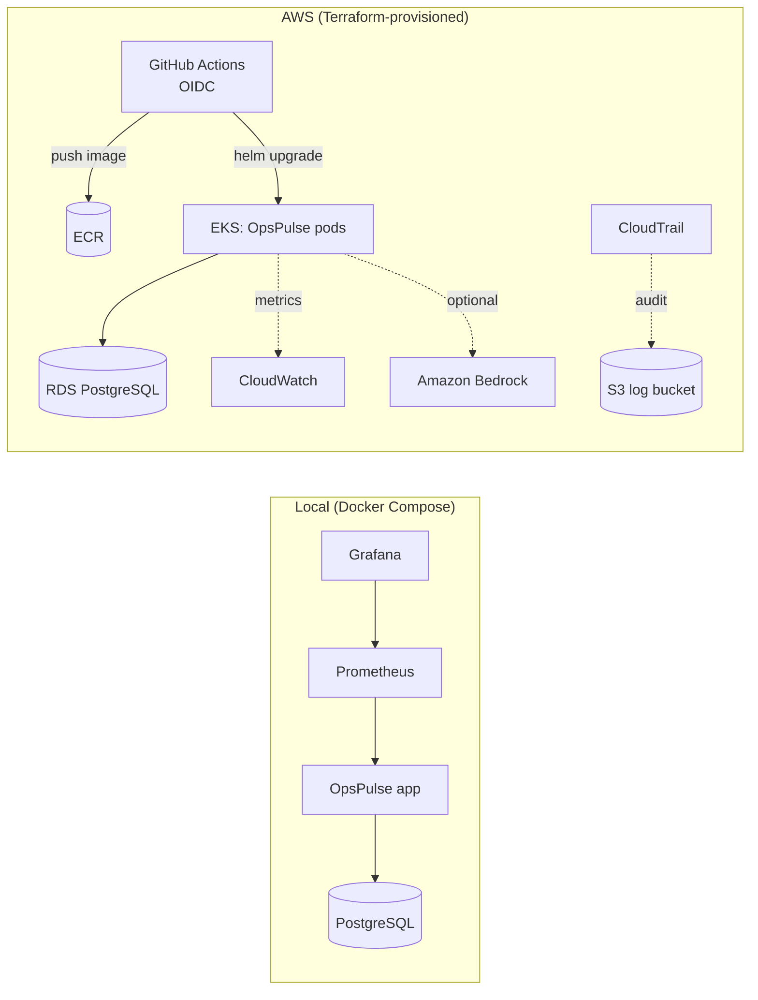

# OpsPulse

OpsPulse is a small **cloud-ops demo application and delivery pipeline**. It exists to demonstrate a modern, lean, 2026-era DevOps/DevSecOps workflow end to end: containerized app → Kubernetes/Helm → Terraform-provisioned AWS → CI/CD with security scanning → observability → AI-assisted incident triage.

## POC/MVP classification

**This is a proof-of-concept / MVP, not a production system.** Scope is deliberately narrow: one application service, one database, one environment. See [Known limitations](#known-limitations) and `docs/ARCHITECTURE.md` for the specific trade-offs made and why.

## Capabilities demonstrated

- Docker (multi-stage, non-root, pinned, scanned)
- Kubernetes + Helm (Deployment/Service/Ingress/HPA/probes/ConfigMap+Secret refs)
- Terraform on AWS (VPC, EKS, ECR, RDS, IAM/OIDC, CloudWatch, CloudTrail)
- GitHub Actions CI/CD (lint, test, scan, build, OIDC deploy, rollback)
- PostgreSQL persistence with Alembic migrations
- Prometheus + Grafana monitoring, with alerting rules
- A read-only AI Incident Assistant (Amazon Bedrock, with mock/fallback modes)
- A controlled, reversible demo-failure mechanism for live demonstrations

## Architecture overview

One FastAPI service ("OpsPulse") backed by PostgreSQL. It exposes a minimal
dashboard, a REST API for services/incidents, health/readiness/metrics
endpoints, and a read-only AI Incident Assistant endpoint. Locally it runs
under Docker Compose with Prometheus and Grafana. In AWS it runs on EKS,
reading from RDS PostgreSQL, with images in ECR and deploys via GitHub
Actions using OIDC (no long-lived AWS keys).



## Technology stack

FastAPI, SQLAlchemy (async) + Alembic, PostgreSQL, Prometheus client,
structlog, Docker, Kubernetes, Helm, Terraform, GitHub Actions, AWS
(VPC/EKS/ECR/RDS/IAM/CloudWatch/CloudTrail), Amazon Bedrock (optional),
Trivy, pytest.

## Local quick start

Prerequisites: Docker + Docker Compose.

```bash
cp .env.example .env
docker compose up -d --build
```

This starts PostgreSQL, the app (migrations run automatically on
container start, then seed data is loaded), Prometheus, and Grafana, with
health checks and startup dependencies wired between them.

Default local endpoints (host ports chosen to avoid clashing with other
local projects — see `.env.example` to change them):

| Service     | URL                              |
|-------------|-----------------------------------|
| Dashboard   | http://localhost:8080/             |
| API docs    | http://localhost:8080/docs         |
| Metrics     | http://localhost:8080/metrics      |
| Prometheus  | http://localhost:59090             |
| Grafana     | http://localhost:53000 (admin/admin) |

Stop everything: `docker compose down` (add `-v` to also remove data volumes).

## Testing instructions

```bash
cd app
python -m venv .venv && source .venv/Scripts/activate  # or .venv/bin/activate on Linux/macOS
pip install -r requirements-dev.txt
pytest -v
```

This runs unit tests, API tests (in-memory SQLite via dependency override),
health/readiness/metrics tests, the controlled-failure test, AI-adapter
tests (mock/fallback/mocked-Bedrock), and a **real PostgreSQL integration
test** that spins up a disposable `postgres:16-alpine` container via the
Docker CLI, applies Alembic migrations, and does a real round-trip. It
skips automatically if Docker isn't available.

`ruff check .` runs linting.

## AWS deployment overview

Terraform (`terraform/`) provisions an isolated VPC, a minimal EKS cluster
with one managed node group, a small single-AZ RDS PostgreSQL instance, an
ECR repository, IAM/OIDC federation for GitHub Actions, CloudWatch log
groups, and a single-region CloudTrail trail for management-event auditing.

```bash
cd terraform
terraform init
terraform plan
terraform apply
```

Deploys to the cluster happen via the Helm chart (`helm/opspulse`), driven
by the `deploy.yml` GitHub Actions workflow.

**This has not been deployed to a live AWS account in this environment** —
no AWS credentials were available. All Terraform code is written, formatted,
and validated (`terraform validate` passes; see `docs/ARCHITECTURE.md`).

### GitHub OIDC setup

Terraform's `iam-oidc` module creates the GitHub OIDC provider and a deploy
role restricted to the repository and either the `production` GitHub
environment or the `main` branch. After `terraform apply`, set the
`DEPLOY_ROLE_ARN` repository variable in GitHub to the
`github_actions_deploy_role_arn` Terraform output, and set
`github_repository` in `terraform.tfvars` to your actual "org/repo" before
applying. No long-lived AWS access keys are used anywhere in CI/CD.

## Monitoring instructions

Prometheus scrapes the app's `/metrics` endpoint (HTTP request rate/error
rate/p95 latency, DB connectivity, open incident count, demo-failure state,
build info) and loads `monitoring/prometheus/alert_rules.yml`
(high error rate, high latency, application unavailable, PostgreSQL
unavailable, repeated pod restarts — the last one requires kube-state-metrics
and only fires in the Kubernetes environment). Grafana auto-provisions the
Prometheus datasource and the "OpsPulse Overview" dashboard on startup —
no manual setup needed.

## AI Incident Assistant

`POST /api/ai/analyze` accepts a **bounded, sanitized** incident context
(alert details, up to 20 metric samples, a log excerpt truncated to a
configurable size, deployment metadata) and returns a structured analysis:
summary, likely cause, supporting evidence, 2–3 recommended actions, a
confidence level, and a warning when evidence is insufficient.

It is **read-only**: it never executes commands and never changes
infrastructure. Input is size-bounded and scrubbed for common secret/token
patterns before use. Three backends are supported, selected via
`AI_BACKEND`:

- `bedrock` — calls Amazon Bedrock (`BEDROCK_MODEL_ID`, default an Anthropic
  Claude Haiku model). Falls back safely to the deterministic analyzer if
  Bedrock is unreachable or errors.
- `mock` — a canned response, used in automated tests so development never
  depends on live AI access.
- `fallback` (default) — a deterministic, rule-based analyzer with no
  external calls.

Every response's `source` field identifies exactly which backend produced
it (`bedrock` / `mock` / `fallback`) — the app never claims a real model
invocation occurred unless it actually did. **Bedrock access was not
available in this environment, so only mock/fallback execution has been
verified; the Bedrock code path is covered by mocked tests only.**

## Five-minute demo flow

See `docs/DEMO_GUIDE.md` for the exact script. Summary: start the stack →
show the Grafana dashboard → trigger the controlled demo failure → watch
metrics/alerts change → create/view an incident → run the AI Incident
Assistant on it → restore the service → confirm recovery → show the
GitHub Actions deploy workflow (or the local Helm/Terraform validation, if
no live AWS/GitHub deploy is available).

## Screenshots

_Not captured in this environment (no interactive browser session available
during the build). Placeholders:_

- `docs/screenshots/dashboard.png` — OpsPulse dashboard
- `docs/screenshots/grafana.png` — Grafana "OpsPulse Overview" dashboard
- `docs/screenshots/incident-ai.png` — AI Incident Assistant response

## Cost and cleanup warning

Applying the Terraform configuration creates **billable AWS resources**
(EKS control plane + nodes, RDS, NAT gateway, S3/CloudTrail). This is a POC
— destroy resources when you're done:

```bash
cd terraform
terraform destroy
```

## Known limitations

- Single AZ for RDS, one shared NAT gateway, no multi-region/multi-account —
  all deliberate POC cost/complexity trade-offs (see `docs/ARCHITECTURE.md`).
- The GitHub Actions deploy role is scoped to the approved repository and
  either the `production` environment or `main`, and EKS access is limited to
  the `opspulse` namespace instead of cluster-wide admin rights.
- CloudTrail is single-region with no KMS CMK and a short retention window.
- No live AWS or Bedrock verification was performed in this build
  environment — see the relevant sections above for exactly what was and
  wasn't exercised.
- The demo-failure mechanism and `AI_BACKEND=mock`/`fallback` must never be
  enabled in a real production deployment; `DEMO_MODE_ENABLED=false` and
  `AI_BACKEND=bedrock` (or `fallback`) are the Helm chart defaults.

## Repository structure

```
app/            FastAPI application, tests, Alembic migrations, Dockerfile
helm/opspulse/  Helm chart (Deployment, Service, Ingress, HPA, ConfigMap, ...)
terraform/      AWS infrastructure (VPC, EKS, ECR, RDS, IAM/OIDC, observability)
monitoring/     Prometheus config/alerts, Grafana provisioning + dashboard
.github/workflows/  CI (lint/test/scan/validate) and Deploy (OIDC, EKS, rollback)
docs/           Architecture, operations runbook, demo guide
scripts/        smoke_test.sh
docker-compose.yml, Makefile, .env.example
```

## Not production-ready

OpsPulse is a portfolio-quality POC/MVP. It has not undergone a production
readiness review, load testing, multi-AZ/DR planning, or a formal security
audit. Do not deploy it to handle real traffic or real data.
