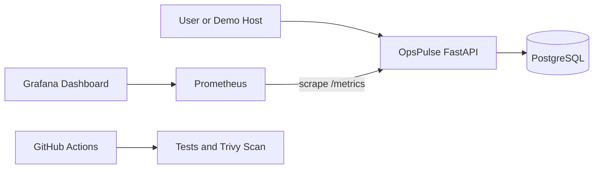

# OpsPulse

OpsPulse is a compact cloud operations portfolio project that demonstrates how a small team can monitor service health, track incidents, and run a repeatable DevSecOps-style workflow without overengineering. It is designed to be understandable quickly by recruiters, technical interviewers, and freelance clients while still showing practical engineering decisions.

## POC / MVP classification

OpsPulse is intentionally a POC/MVP and is not production-ready. The repository prioritizes clarity, demo reliability, and realistic implementation patterns over enterprise-scale complexity.

That scope choice is deliberate: this repository aims to show decision quality and maintainability for a small engagement, not to claim full production hardening.

## Core capabilities

- Service inventory and status tracking through a lightweight FastAPI app.
- Incident creation and visibility tied to monitored services.
- Controlled demo failure and recovery flow for presentation scenarios.
- Request, latency, and health telemetry exposed for Prometheus and Grafana.
- AI-assisted incident analysis endpoint with safe, read-only behavior.
- CI validation path for application quality, container security scanning, Helm checks, and Terraform checks.

Each capability is implemented in a way that favors explainability. This makes the project useful not only as a runnable demo, but also as a conversation artifact where reviewers can inspect design trade-offs, delivery constraints, and operational guardrails without navigating a sprawling codebase.

From a hiring perspective, this project is intentionally practical: it demonstrates API design, persistence, observability, secure-by-default route protection, container workflows, and infrastructure-as-code literacy in one coherent narrative. From a client perspective, it shows how a lightweight MVP can be delivered with enough operational discipline to support demos, technical due diligence, and iterative expansion, without prematurely committing to large-system complexity.

## Architecture at a glance



This diagram shows the local MVP flow only. Detailed architecture, security trade-offs, OIDC trust details, and AI backend behavior are documented in docs/ARCHITECTURE.md.

## Technology stack

- Backend: FastAPI, SQLAlchemy (async), Alembic.
- Data: PostgreSQL.
- Observability: Prometheus and Grafana.
- Container and packaging: Docker Compose and Helm.
- Infrastructure as code: Terraform-defined AWS architecture.
- CI/CD: GitHub Actions.
- AI integration path: Bedrock, mock, and fallback adapters behind one service interface.

## Local quick start

```bash
cp .env.example .env
docker compose up -d --build
```

Stop the local stack:

```bash
docker compose down
```

## Local service URLs

- App: http://localhost:8080/
- API docs: http://localhost:8080/docs
- Prometheus: http://localhost:59090
- Grafana: http://localhost:53000

## Tests and validation

```bash
cd app
python -m venv .venv
. .venv/Scripts/activate
pip install -r requirements-dev.txt
pytest -q
ruff check .
cd ../terraform
terraform fmt -recursive
terraform init
terraform validate
terraform plan
```

## Five-minute demo summary

In a typical five-minute walkthrough, you start the stack, confirm healthy services, trigger a controlled degradation scenario, observe telemetry and alert movement, create or review an incident, run the AI analysis endpoint, and then restore healthy behavior. This sequence demonstrates monitoring, incident handling, and recovery without requiring a large platform footprint.

Full presenter script, timing, and command-by-command demo flow are in docs/DEMO_GUIDE.md.

## CI/CD pipeline

The `CI` workflow (`.github/workflows/ci.yml`) runs on every push and pull
request to `main` and must pass green:

- **Lint & Test** — `ruff check`, Alembic migrations, and the pytest suite
  against a real Postgres service container.
- **Build, Scan & Verify Image** — builds the Docker image, runs two Trivy
  scans (filesystem and image, `HIGH`/`CRITICAL` severity only, unfixed
  findings ignored), and verifies the container runs as the non-root
  `opspulse` user.
- **Terraform fmt & validate** — formatting and validation with no backend.
- **Helm lint & template** — chart lint and template rendering with sample
  values.

The `Deploy` workflow (`.github/workflows/deploy.yml`) runs after a
successful `CI` run on `main` (or via manual dispatch), but only executes
when a `DEPLOY_ROLE_ARN` repository variable is configured with a real AWS
OIDC deploy role. Without it, the workflow skips cleanly instead of failing
— this repo ships without live AWS infrastructure attached, so Deploy is
inactive by design until that variable is set.

## AWS and Terraform status

OpsPulse includes a Terraform-defined AWS architecture for ECR, EKS, networking, IAM OIDC trust, observability components, and RDS-aligned deployment structure.

AWS infrastructure is defined as code and validated through Terraform formatting, initialization, validation, and planning where credentials permit. Terraform apply was intentionally not executed, and no AWS resources were created.

## Repository structure

```text
app/          FastAPI application, routes, data models, tests, Docker assets
docs/         Architecture, operations runbook, and demo walkthrough
monitoring/   Prometheus config and Grafana provisioning
helm/         Kubernetes packaging for OpsPulse
terraform/    Terraform-defined AWS architecture modules and root configuration
scripts/      Smoke test and helper scripts
```

## Known limitations

- This is a demo-first MVP and does not include high-availability or disaster-recovery guarantees.
- Bedrock-backed AI behavior depends on external credentials and may run in fallback/mock modes in local demos.
- Kubernetes and Terraform paths are validated in code and CI workflows, but were not applied to create live AWS resources in this environment.
- Security hardening is intentional for a portfolio scope, not a full compliance baseline.

## Documentation

- Architecture and security details: docs/ARCHITECTURE.md
- Operations, monitoring, rollback, and cleanup: docs/OPERATIONS_RUNBOOK.md
- Full presentation flow: docs/DEMO_GUIDE.md
