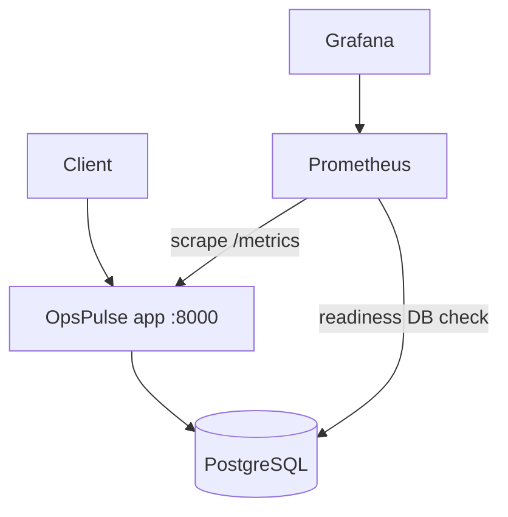
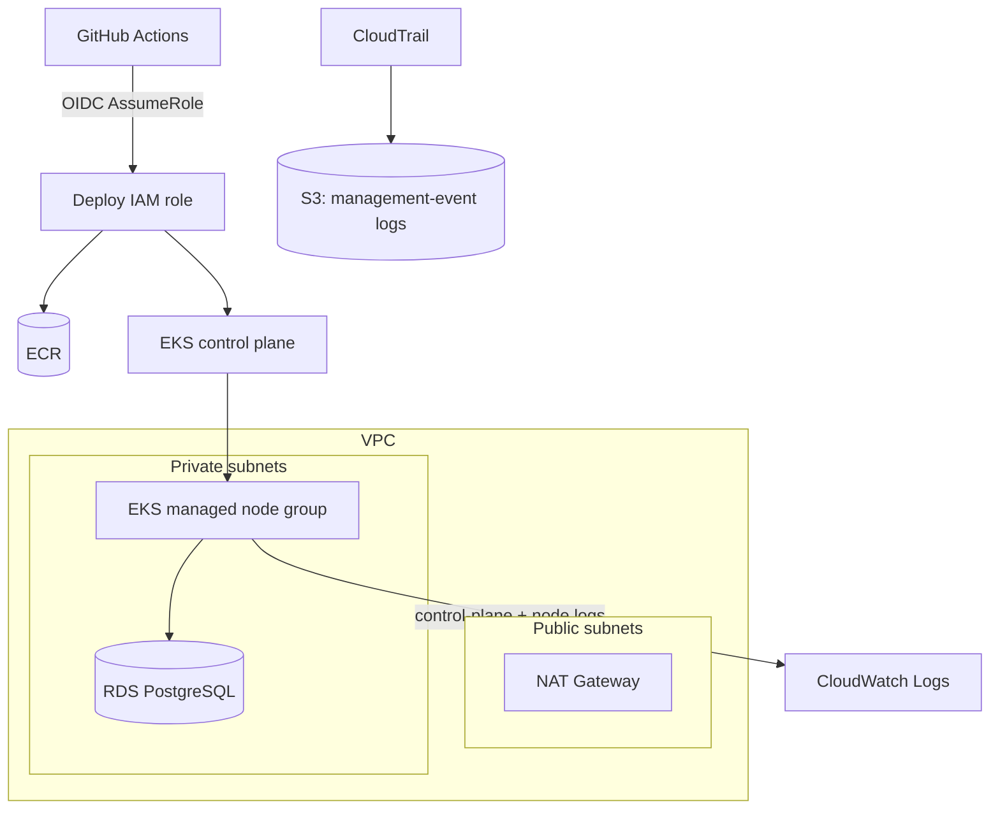

# Architecture

## Components

- **OpsPulse app** — a single FastAPI service. Routers: dashboard (HTML),
  services (CRUD), incidents (CRUD), health (`/healthz`, `/readyz`),
  metrics (`/metrics`, Prometheus format), demo (controlled fault
  injection), AI (`/api/ai/analyze`).
- **PostgreSQL** — the only datastore. Schema managed by Alembic
  (`app/migrations`).
- **Prometheus** — scrapes the app; evaluates `monitoring/prometheus/alert_rules.yml`.
- **Grafana** — auto-provisioned datasource + one dashboard.
- **Helm chart** (`helm/opspulse`) — packages the app for Kubernetes.
- **Terraform** (`terraform/`) — provisions the AWS environment the chart deploys into.
- **GitHub Actions** — CI (`ci.yml`) and CD (`deploy.yml`).
- **AI Incident Assistant** (`app/opspulse/ai/`) — pluggable backend
  (Bedrock / mock / deterministic fallback) behind one service function.

## Request flow

Browser/client → FastAPI (`opspulse.main:app`) → a `metrics_middleware`
records request count/latency/errors → router handler → SQLAlchemy async
session → PostgreSQL. `/metrics` is scraped by Prometheus independently of
user traffic.

## Deployment flow

**Local:** `docker compose up` builds the app image, starts Postgres, waits
for its healthcheck, starts the app (which runs `alembic upgrade head` via
`docker-entrypoint.sh` before `uvicorn`), waits for the app's healthcheck,
then runs a one-shot `seed` container, and starts Prometheus/Grafana.

**AWS:** `deploy.yml` assumes an IAM role via GitHub OIDC (no static keys),
builds and pushes the image to ECR tagged with the Git commit SHA, then
runs `helm upgrade --install` against EKS, waits for rollout, runs a smoke
test pod, and rolls back via `helm rollback` if either step fails.

## Local architecture

## AWS architecture

## Security boundaries

- The app container runs as a non-root user (UID 10001), drops all Linux
  capabilities, and disallows privilege escalation (Dockerfile, Helm
  `securityContext`).
- Database credentials never appear in the Helm chart's values or
  ConfigMap — only a reference to an **existing** Kubernetes Secret
  (`database.existingSecret`) is used; the chart does not create secrets.
- RDS is not publicly accessible; only the EKS node security group is
  granted ingress on 5432.
- GitHub Actions authenticates to AWS via OIDC — no long-lived AWS access
  keys are stored anywhere.
- The AI Incident Assistant is read-only by construction: it has no tool
  execution capability, no infrastructure-mutation code path, and its
  input passes through `opspulse.ai.sanitize` (secret/token pattern
  redaction + hard size cap) before use.
- The controlled demo-failure mechanism (`/api/demo/fail`) is gated by
  `DEMO_MODE_ENABLED`, which defaults to `false` in the Helm chart.

## Main design decisions and trade-offs

| Decision | Reasoning | Trade-off |
|---|---|---|
| One service, not microservices | Task explicitly scoped to a single app; avoids unnecessary distributed-systems complexity | Less "impressive" architecture, but appropriate for the stated goal |
| Raw Terraform resources over a community EKS module | Transparent, reviewable IaC for a portfolio piece; no hidden defaults | More lines of HCL than using `terraform-aws-modules/eks` |
| Plain Prometheus pod annotations, no ServiceMonitor requirement | Avoids depending on the prometheus-operator CRDs (kept optional) | Slightly less "GitOps-native" than a ServiceMonitor-only design |
| Single shared NAT gateway | Cost control for a POC | Reduced AZ-level fault tolerance for egress traffic |
| Single-AZ RDS, no read replica | Cost control | No HA/failover for the database |
| CI/CD deploy role trusts the whole repo, granted cluster-admin EKS access | Keeps the OIDC/Helm setup simple for a single-purpose demo cluster | Broader-than-ideal blast radius if the repo's CI were compromised — acceptable only because the cluster is single-purpose and isolated |
| CloudTrail: single-region, AWS-managed KMS key, 30-day S3 lifecycle | Cost/complexity control | Weaker long-term audit retention than a production trail |
| Local Postgres integration test spins up a real Docker container | Real DB behavior for the one test that matters most, without requiring a permanently running DB | Test is skipped if Docker isn't available in the runner |

## POC limitations

- Not deployed/verified against a live AWS account in this build (no AWS
  credentials available in this environment). Terraform is fully written,
  formatted, and validated; a real `apply`/EKS/RDS verification is
  outstanding.
- Bedrock invocation is covered only by mocked tests; no real Bedrock
  access was available to verify actual model output end to end.
- No multi-AZ high availability, no disaster-recovery plan, no load
  testing, no formal security audit.
